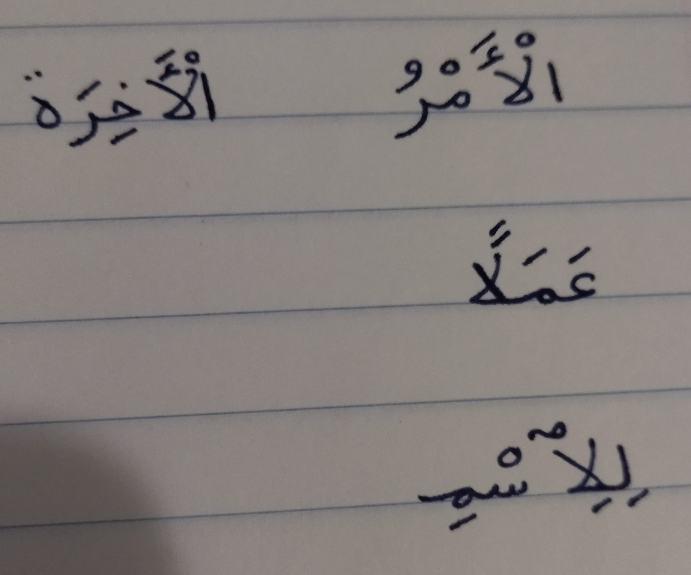
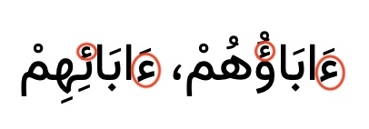
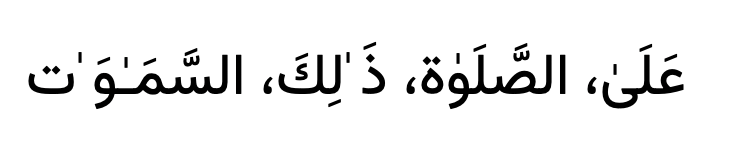
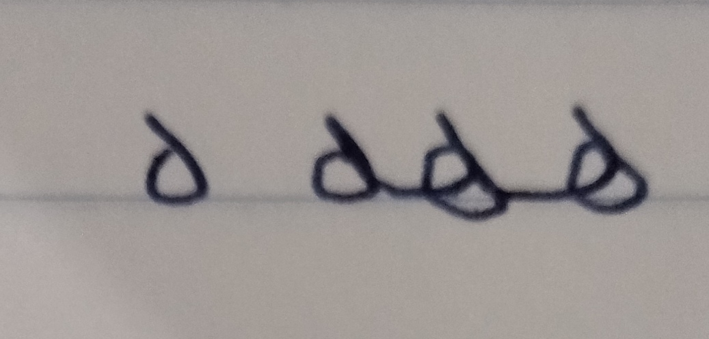
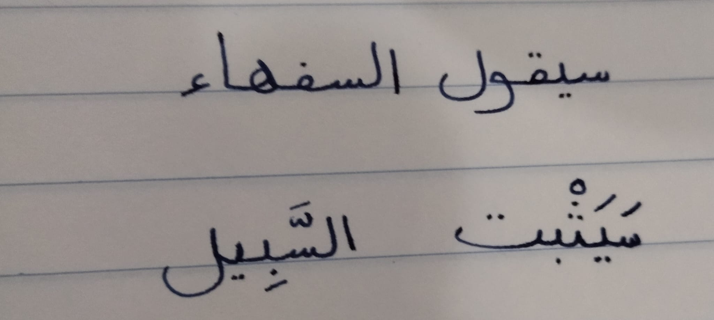

# Zaheermatn Font خط ظهير متن

Zaheermatn is an Arabic font project forked from Vazirmatn.

## Design brief

#### Lam-alef ligature

Use classic لا ligature in initial, standalone, and final positions:

#### Hamza

* Make standalone hamza ء size smaller to match seated (combined) hamza ؤ أ ئ

* Add support for inline hamza, 
  * Implementation should match Amiri's so that typing ء between two joining letters will not break the joining.
  * Also allow for Hamza combined with tatweel implementation.
  * Pay special attention to hamza between lam-alef ligature.

<https://adamiturabi.github.io/arabic-tutorial-book/content/hamzah_rules.html>

#### Fix inline dagger alif

* Make dagger alif slightly bigger.
* See if positioning needs to be fixed above tatweel and above no-break-space. No-break-space may need to be slimmer when it has a dagger alif on it.

#### heh

The character ه should follow a basic form in all 4 positions: 

* Initial and medial dips below baseline.
* Final and standalone stays above baseline.

#### kaf

Use ک for Arabic kaf instead of ك

#### seen

The teeth of seen س should be shorter and closer together to distinguish from ب.
Also, don't raise first tooth to make it higher than the following ones in initial position.

#### Add honorifics

Copy over from Kitab font

* U+0610 (ؐ) – Arabic Sign Sallallahou Alayhe Wasallam
* U+0611 (ؑ) – Arabic Sign Alayhe Assallam
* U+0612 (ؒ) – Arabic Sign Rahmatullah Alayhe (May God's mercy be upon him)
* U+0613 (ؓ) – Arabic Sign Radi Allahu Anhu (May God be pleased with him)
* U+0614 (ؔ) – Arabic Sign Takhallus (used for poetic pen names)

Spacing Ligatures & Symbol Characters (U+FD00 – U+FDFA range)
These are pre-composed character glyphs representing complete honorific phrases:

* U+FDFA (ﷺ) – Arabic Ligature Sallallahu Alayhi Wasallam (Peace be upon him)
* U+FDFB (ﷻ) – Arabic Ligature Jallajalaluhu (Glorified and Exalted is He)
* U+FD40 (﵀) – Arabic Ligature Rahimahu Allaah (May God have mercy on him)
* U+FD41 (﵁) – Arabic Ligature Radi Allaahu Anh (May God be pleased with him)
* U+FD42 (﵂) – Arabic Ligature Radi Allaahu Anhaa (May God be pleased with her)
* U+FD43 (﵃) – Arabic Ligature Radi Allaahu Anhum (May God be pleased with them)
* U+FD47 (﵇) – Arabic Ligature Alayhi As-Salaam (Peace be upon him)
* U+FD4B (﵋) – Quddisa Sirrah (May his secret be sanctified)
* U+FD4C (﵌) – Sallallahu Alayhi Wa-Aalihee Wa-Sallam
* U+FD4E (﵎) – Tabaaraka Wa-Ta'aalaa (Blessed and Lofty)

#### Break up/remove U+fdf2 ligature for اللفظ الجلالة

U+fdf2 ligature for اللفظ الجلالة causes problems regarding the initial alif, and also whether the shaddah should have an dagger alif or a fatha.

If U+fdf2 is entered by the user then break it up into up into alif lam lam heh.

https://github.com/w3c/alreq/issues/125

